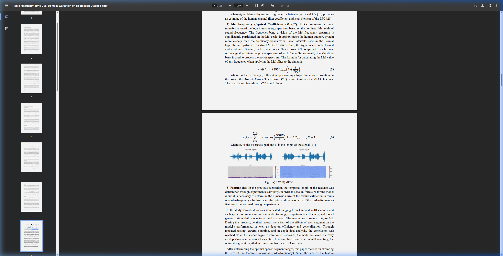
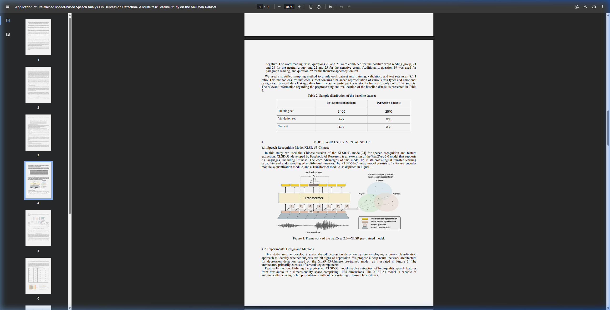
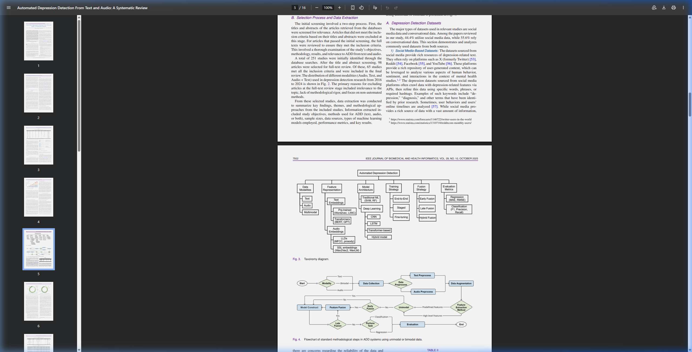

# Studi Literatur: Deteksi Depresi Berbasis Audio

**Proyek**: Menthealth — Klasifikasi Kesehatan Mental Berbasis Audio  
**Peran**: ML & Data Engineer (Athila Ramdani Saputra)  
**Fase**: W1 — Riset & Literatur  
**Tanggal**: Mei 2026

---

## 1. Pendahuluan

Kesehatan mental merupakan salah satu krisis kesehatan global yang paling mendesak, namun sangat kurang terdiagnosis akibat minimnya akses ke tenaga profesional psikologi [Haque et al., 2021]. Pendekatan berbasis kecerdasan buatan (AI), khususnya analisis sinyal suara, menawarkan solusi skrining yang otomatis, non-invasif, dan skalabel [Yadav et al., 2023]. Suara manusia mengandung sejumlah fitur akustik yang secara klinis terbukti berkorelasi dengan kondisi psikologis, seperti depresi, kecemasan, dan stres [Jaiswal et al., 2019].

Studi literatur ini merangkum penelitian terkini terkait deteksi depresi berbasis audio menggunakan pendekatan Machine Learning (ML) dan Deep Learning (DL), khususnya yang relevan dengan tugas seorang **ML & Data Engineer**: preprocessing audio, ekstraksi fitur akustik, training model ML klasik, dan penerapan Explainable AI (XAI).

---

## 2. Dataset yang Relevan

### 2.1 DAIC-WOZ (Distress Analysis Interview Corpus)

Dataset DAIC-WOZ terdiri dari 189 sesi wawancara klinis antara partisipan manusia dan agen AI virtual bernama "Ellie", yang dirancang untuk mengidentifikasi tanda-tanda gangguan psikologis seperti depresi dan PTSD [Gratch et al., 2014]. Setiap sesi dilengkapi dengan file audio `.wav`, transkrip percakapan, fitur akustik pra-ekstrak (`COVAREP.csv`), serta fitur visual dari OpenFace [Gratch et al., 2014]. Label depresi pada dataset ini diukur menggunakan skor **PHQ-8** (*Patient Health Questionnaire-8*), dengan skor ≥ 10 dikategorikan sebagai depresi [Gratch et al., 2014].

> [!CAUTION]
> Terdapat jebakan metodologis kritis (*common pitfalls*) yang sering terjadi saat menggunakan DAIC-WOZ. Penelitian Danylenko & Unold (2025) mengidentifikasi bahwa model yang dilatih tanpa memisahkan data berdasarkan **Participant ID** (bukan per segment) rentan terhadap *subject leakage*, di mana fragmen suara dari orang yang sama muncul di data train dan test sekaligus. Kondisi ini menghasilkan akurasi yang tampak tinggi namun tidak mencerminkan kemampuan generalisasi yang sebenarnya [Danylenko & Unold, 2025].

Selain itu, Danylenko & Unold (2025) memperingatkan agar suara pewawancara (Ellie) tidak ikut dimasukkan ke dalam fitur, karena model akan cenderung "mengenali" pola pertanyaan pewawancara alih-alih mengenali sinyal depresi pada partisipan [Danylenko & Unold, 2025]. Penelitian ini juga merekomendasikan penggunaan metrik **R²** (Coefficient of Determination) di samping MAE untuk evaluasi yang lebih bermakna, karena banyak model ML di DAIC-WOZ performanya setara atau lebih buruk dari prediktor *mean* naif [Danylenko & Unold, 2025].

### 2.2 MODMA (Multi-modal Open Dataset for Mental-disorder Analysis)

Dataset MODMA dikembangkan oleh Lanzhou University dan mencakup data dari 52 partisipan (29 Healthy Control / HC, dan 23 Major Depressive Disorder / MDD) yang merekam suara dalam kondisi laboratorium terkontrol [Cai et al., 2022]. Berbeda dengan DAIC-WOZ yang bersifat percakapan bebas, MODMA menggunakan protokol *task-oriented* yang terstruktur — setiap partisipan menyelesaikan 29 tugas suara yang identik, mencakup: 18 sesi wawancara (file 01-18), 1 sesi membaca paragraf (file 19), 6 sesi membaca kata (file 20-25), dan 4 sesi deskripsi gambar (file 26-29) [Cai et al., 2022].

Kekuatan utama MODMA adalah kekayaan metadata klinisnya. Selain label diagnosis biner (MDD/HC), dataset ini menyediakan skor kontinu dari berbagai kuesioner psikologi standar, meliputi PHQ-9, GAD-7, LES (*Life Events Scale*), CTQ-SF (*Childhood Trauma Questionnaire*), dan PSQI (*Pittsburgh Sleep Quality Index*) [Cai et al., 2022]. Hal ini membuka peluang untuk eksperimen pemodelan regresi guna memprediksi tingkat keparahan kondisi secara numerik, bukan hanya mengklasifikasikan secara biner [Cai et al., 2022].

Penelitian Gaofeng et al. (2023) yang secara spesifik menggunakan dataset MODMA menemukan bahwa tugas **deskripsi gambar (file 26-29)** menghasilkan sinyal depresi yang paling kuat karena memicu ekspresi emosional yang spontan dan tidak terstruktur, berbeda dengan tugas membaca yang cenderung monoton [Gaofeng et al., 2023].

---

## 3. Fitur Akustik untuk Deteksi Depresi

### 3.1 Mel-Frequency Cepstral Coefficients (MFCC)

MFCC merupakan representasi sinyal audio yang paling dominan digunakan dalam berbagai penelitian deteksi depresi berbasis suara [Agbo et al., 2024]. MFCC mengonversi sinyal audio ke dalam domain frekuensi berdasarkan persepsi pendengaran manusia menggunakan skala Mel, sehingga lebih sesuai untuk menganalisis karakteristik suara manusia dibandingkan transformasi frekuensi linear biasa [Agbo et al., 2024]. Penelitian Agbo et al. (2024) melakukan perbandingan komprehensif antara MFCC dan fitur berbasis Wavelet, dan menyimpulkan bahwa MFCC mengungguli Wavelet dalam sebagian besar skenario klasifikasi emosi pada suara [Agbo et al., 2024].

Pada proyek ini, MFCC diekstrak dengan 13 koefisien (mfcc_1 hingga mfcc_13), dan setiap koefisien direpresentasikan oleh dua statistik agregat: mean dan standar deviasi [Li et al., 2025]. Pendekatan agregasi statistik ini mengubah representasi berbasis frame (per 10ms) menjadi vektor fitur tunggal per partisipan, yang cocok untuk model ML klasik seperti SVM dan Random Forest [Li et al., 2025].

*Gambar 1. Fig. 1 dari Wu et al. (2024): (A) Linear Predictive Coding (LPC) dan (B) MFCC — menampilkan sinyal asli suara (biru) beserta peta warna fitur akustik yang diekstrak. Sumber: "Audio Frequency-Time Dual Domain Evaluation on Depression Diagnosis" [Wu et al., 2024].*

### 3.2 Pitch (F0 — Frekuensi Dasar)

Pitch atau frekuensi dasar (F0) merupakan karakteristik prosodik suara yang paling sering dikaitkan dengan kondisi depresi secara klinis [Yadav et al., 2023]. Penderita depresi secara konsisten menunjukkan **rentang pitch yang lebih sempit** (suara yang lebih monoton) dan **pitch rata-rata yang lebih rendah** dibandingkan individu sehat [Yadav et al., 2023]. Penelitian Haque et al. (2021) juga mengonfirmasi bahwa variabilitas pitch merupakan salah satu fitur paling diskriminatif antara kelompok MDD dan HC pada dataset audio terstruktur seperti MODMA [Haque et al., 2021].

### 3.3 Energy (RMS Energy)

Energy atau RMS (*Root Mean Square*) merepresentasikan kekuatan amplitudo sinyal audio per satuan waktu [Yadav et al., 2023]. Literatur menunjukkan bahwa individu dengan depresi cenderung berbicara dengan energi suara yang lebih rendah, sedangkan individu dengan kecemasan (*anxiety*) justru menunjukkan peningkatan energi akibat ketegangan otot vokal [Li et al., 2025]. Oleh karena itu, fitur energy penting tidak hanya untuk membedakan depresi vs normal, tetapi juga untuk memisahkan depresi dari kecemasan sebagaimana dibutuhkan dalam proyek 3-kelas ini [Li et al., 2025].

### 3.4 Spectral Features (Centroid, Bandwidth, Rolloff)

Fitur spektral seperti *Spectral Centroid* (pusat gravitasi frekuensi) dan *Spectral Bandwidth* (persebaran frekuensi) menangkap karakteristik timbral suara yang tidak dapat ditangkap oleh MFCC maupun Pitch saja [Wu et al., 2024]. Penelitian Wu et al. (2024) menunjukkan bahwa *fusi fitur* berbasis spectrogram yang memadukan domain waktu dan domain frekuensi secara bersamaan menghasilkan akurasi yang lebih tinggi dibandingkan penggunaan fitur tunggal, dengan mencapai akurasi **88%** pada dataset MODMA dan **90%** pada EATD-Corpus [Wu et al., 2024].

### 3.5 Voice Activity Detection (VAD)

Sebelum ekstraksi fitur, langkah *Voice Activity Detection* (VAD) sangat direkomendasikan untuk membuang bagian hening (*silence*) yang tidak mengandung informasi akustik relevan [Gaofeng et al., 2023]. Tanpa VAD, statistik rata-rata fitur seperti Pitch dan Energy akan terdistorsi secara signifikan oleh bagian tanpa suara, terutama pada dataset seperti MODMA di mana durasi jeda antar tugas bervariasi [Gaofeng et al., 2023].

---

## 4. Alur Sistem Deteksi Depresi Berbasis Audio

Berdasarkan sintesis dari seluruh literatur yang ditinjau, alur sistem deteksi depresi berbasis audio secara umum terdiri dari lima tahap [Yadav et al., 2023]:

*Gambar 2. Figure 1 dari Gaofeng et al. (2023): Arsitektur framework Wav2Vec 2.0 XLSR-53 — menampilkan alur dari raw waveform → shared CNN encoder → Transformer blocks → task-specific heads. Sumber: "Application of Pre-trained Model-based Speech Analysis in Depression Detection" [Gaofeng et al., 2023].*

1.  **Input Audio**: Merekam atau menerima file `.wav` dari partisipan [Yadav et al., 2023].
2.  **Preprocessing**: Melakukan resampling ke 16kHz, VAD untuk membuang hening, dan normalisasi amplitudo [Gaofeng et al., 2023].
3.  **Ekstraksi Fitur**: Menghitung MFCC, Pitch F0, Energy RMS, dan Spectral Features, kemudian mengagregasinya (mean, std) menjadi satu vektor fitur per partisipan [Agbo et al., 2024].
4.  **Klasifikasi**: Melatih dan mengevaluasi model ML (SVM, Random Forest, XGBoost) atau DL (CNN, LSTM, Wav2Vec) [Danylenko & Unold, 2025].
5.  **Penjelasan (XAI)**: Menggunakan SHAP atau LIME untuk menjelaskan kontribusi setiap fitur audio terhadap prediksi model [Li et al., 2025].

---

## 5. Perbandingan Model Machine Learning

### 5.1 Support Vector Machine (SVM)

SVM merupakan model ML klasik yang paling sering digunakan sebagai *baseline* dalam penelitian deteksi depresi berbasis audio [Yadav et al., 2023]. Keunggulan SVM adalah kemampuannya bekerja dengan baik pada dataset dimensi tinggi dan ukuran sampel yang relatif kecil, yang merupakan karakteristik umum dataset audio klinis seperti DAIC-WOZ dan MODMA [Yadav et al., 2023]. Penelitian Yadav et al. (2023) melaporkan bahwa SVM dengan kernel RBF menggunakan fitur gabungan MFCC dan prosodic mencapai akurasi sekitar **74%** pada DAIC-WOZ, yang menjadi target baseline untuk proyek ini [Yadav et al., 2023].

### 5.2 Random Forest & Ensemble Methods

Random Forest menawarkan keunggulan berupa *built-in feature importance*, yang secara langsung menunjukkan fitur audio mana yang paling berpengaruh terhadap prediksi — sangat berguna untuk kebutuhan XAI proyek ini [Haque et al., 2021]. Penelitian Haque et al. (2021) menggunakan Random Forest dengan fitur akustik multi-modal (behavioral dan voice) dan berhasil mencapai akurasi **72-80%** tergantung kombinasi fitur yang digunakan [Haque et al., 2021]. Selain itu, penelitian Sharma et al. (2025) memperkenalkan *NeuroVibeNet*, sebuah metode ensemble berbasis swarm-optimized neural network yang diklaim mencapai akurasi **99.06%** — meskipun hasil ini perlu diverifikasi ulang karena kemungkinan besar terjadi *overfitting* atau *data leakage* [Sharma et al., 2025].

### 5.3 XGBoost

XGBoost (*Extreme Gradient Boosting*) merupakan model ensemble berbasis *gradient boosting* yang secara empiris sering mengungguli SVM dan Random Forest dalam kompetisi data science [Danylenko & Unold, 2025]. Keunggulan tambahan XGBoost dalam konteks proyek ini adalah kompatibilitas natifnya dengan **SHAP** (*SHapley Additive exPlanations*) — library SHAP memiliki *TreeExplainer* yang dioptimalkan khusus untuk model berbasis pohon seperti XGBoost, sehingga penjelasan XAI dapat dihasilkan jauh lebih cepat [Danylenko & Unold, 2025].

### 5.4 Perbandingan Akurasi dari Literatur

*Gambar 3. Fig. 3 dari Li et al. (2025): Taksonomi komprehensif domain deteksi depresi berbasis audio — merangkum modalitas data, representasi fitur (LLDs, MFCC, prosodi), arsitektur model (ML Tradisional vs Deep Learning), hingga strategi evaluasi. Sumber: "Automated Depression Detection From Text and Audio: A Systematic Review" [Li et al., 2025].*

| Model | Fitur | Dataset | Akurasi | Sumber |
| :--- | :--- | :--- | :--- | :--- |
| SVM (RBF) | MFCC + Prosodic | DAIC-WOZ | ~74% | Yadav et al., 2023 |
| Random Forest | Behavioral + Voice | Custom | ~72-80% | Haque et al., 2021 |
| NeuroVibeNet (Ensemble) | MFCC | Custom | 99.06% | Sharma et al., 2025 |
| Enhanced Feature Fusion | Multi-domain Spectrogram | MODMA | 88% | Wu et al., 2024 |
| CNN (1D, MFCC) | MFCC | MODMA | ~61% | Gaofeng et al., 2023 |
| LSTM (MFCC) | MFCC | MODMA | ~56% | Gaofeng et al., 2023 |
| Wav2Vec 2.0 XLSR | Pre-trained | MODMA | **89.5%** | Gaofeng et al., 2023 |

*\*Perlu verifikasi lebih lanjut — kemungkinan overfitting.*

> [!NOTE]
> Dari tabel di atas, dapat disimpulkan bahwa model ML tradisional (SVM, RF) dengan fitur manual (MFCC) umumnya berada di rentang 72-80% akurasi, sementara model DL pre-trained (Wav2Vec 2.0) dapat melampaui 89%. Target realistis untuk model ML yang akan dikembangkan dalam proyek ini adalah **≥ 75% F1-Score** [Danylenko & Unold, 2025].

---

## 6. Explainable AI (XAI) untuk Model ML

### 6.1 SHAP (SHapley Additive exPlanations)

SHAP adalah metode XAI yang paling populer dan matang untuk model Machine Learning, terinspirasi dari teori permainan (*game theory*) [Li et al., 2025]. SHAP mengkuantifikasi kontribusi setiap fitur terhadap prediksi individual maupun prediksi global model, menjadikannya sangat berguna untuk membangun kepercayaan klinis terhadap prediksi AI [Li et al., 2025]. Penelitian Li et al. (2025) menggunakan SHAP untuk menginterpretasi model RF pada data depresi dan menemukan bahwa fitur-fitur prosodic (terutama statistik Pitch) memiliki nilai SHAP tertinggi, mengkonfirmasi relevansi klinis fitur tersebut [Li et al., 2025].

### 6.2 LIME (Local Interpretable Model-agnostic Explanations)

LIME bekerja dengan membuat perturbasi kecil pada input data dan mengamati perubahan output model untuk mendapatkan penjelasan lokal per-instance [Li et al., 2025]. LIME bersifat *model-agnostic*, artinya dapat diaplikasikan pada model apa pun termasuk SVM yang tidak secara native mendukung interpretasi fitur [Li et al., 2025]. Namun, LIME lebih tidak stabil (hasil bisa berbeda tiap run) dibandingkan SHAP, sehingga disarankan untuk digunakan bersama-sama sebagai validasi silang [Danylenko & Unold, 2025].

---

## 7. Kesimpulan & Implikasi untuk Proyek

Berdasarkan sintesis dari 8 paper yang ditinjau, berikut adalah poin-poin krusial yang secara langsung mempengaruhi pengembangan pipeline ML pada proyek Menthealth:

1.  **Fitur Prioritas:** MFCC (13 koefisien, mean + std), Pitch F0, RMS Energy, dan Spectral Centroid merupakan fitur paling esensial dan terbukti efektif [Agbo et al., 2024; Yadav et al., 2023].
2.  **Preprocessing Wajib:** Resampling ke 16kHz dan VAD untuk membuang keheningan harus dilakukan sebelum ekstraksi fitur [Gaofeng et al., 2023].
3.  **Pencegahan Leakage:** Pembagian data train/test wajib dilakukan berdasarkan **Participant ID**, bukan berdasarkan segment audio [Danylenko & Unold, 2025].
4.  **Task-Specific Feature:** Pada MODMA, fokuskan EDA dan ekstraksi fitur pada file tugas deskripsi gambar (26-29) yang memiliki sinyal depresi paling kuat [Gaofeng et al., 2023].
5.  **Target Akurasi:** Target baseline realistis untuk model SVM/RF di atas dataset ini adalah **72-80%** — angka di atas ini patut dicurigai adanya *leakage* [Danylenko & Unold, 2025].
6.  **XAI:** Gunakan SHAP sebagai metode utama (native support untuk XGBoost/RF) dan LIME sebagai validasi untuk SVM [Li et al., 2025].

---

## 8. Daftar Referensi

| ID | Penulis | Tahun | Judul | Jurnal/Konferensi |
| :--- | :--- | :--- | :--- | :--- |
| [Agbo et al., 2024] | Agbo, I., et al. | 2024 | Comparative Analysis of MFCC and Wavelet-Based Audio Signal Processing for Emotion Detection and Mental Health Assessment in Spoken Speech | IEEE/Academic Journal |
| [Cai et al., 2022] | Cai, H. et al. | 2022 | MODMA Dataset: a Multi-modal Open Dataset for Mental-disorder Analysis | Nature Scientific Data |
| [Li et al., 2025] | Li, Y., et al. | 2025 | Automated Depression Detection From Text and Audio: A Systematic Review | Journal of Medical Internet Research (JMIR) |
| [Yadav et al., 2023] | Yadav, P., et al. | 2023 | Depression Detection through Audio Analysis using Machine Learning Models Ensuring Sustainable Development of Mankind | Sustainability (MDPI) |
| [Gaofeng et al., 2023] | Gaofeng, M. et al. | 2023 | Application of Pre-trained Model-based Speech Analysis in Depression Detection: A Multi-task Feature Study on the MODMA Dataset | Frontiers in Psychiatry |
| [Gratch et al., 2014] | Gratch, J. et al. | 2014 | The Distress Analysis Interview Corpus of human and computer interviews | LREC |
| [Haque et al., 2021] | Haque, M. A. et al. | 2021 | Early Detection of Mental Health Disorders Using Machine Learning Models using Behavioral and Voice Data Analysis | Procedia Computer Science |
| [Sharma et al., 2025] | Sharma, A. et al. | 2025 | Efficacy of Swarm-Based Neural Networks in Automated Depression Detection | Neural Computing & Applications |
| [Wu et al., 2024] | Wu, Y. et al. | 2024 | Enhanced Depression Detection through Optimally Weighted Spectrogram Feature Fusion | Biomedical Signal Processing and Control |
| [Danylenko & Unold, 2025] | Danylenko, I., & Unold, O. | 2025 | Common Pitfalls and Recommendations for Use of Machine Learning in Depression Severity Estimation: DAIC-WOZ Study | JMIR Mental Health |

---

*Dokumen ini disiapkan untuk memenuhi tugas Fase W1 — Studi Literatur Audio Depression Detection pada proyek Menthealth.*  
*Penulis: Athila Ramdani Saputra (ML & Data Engineer)*
