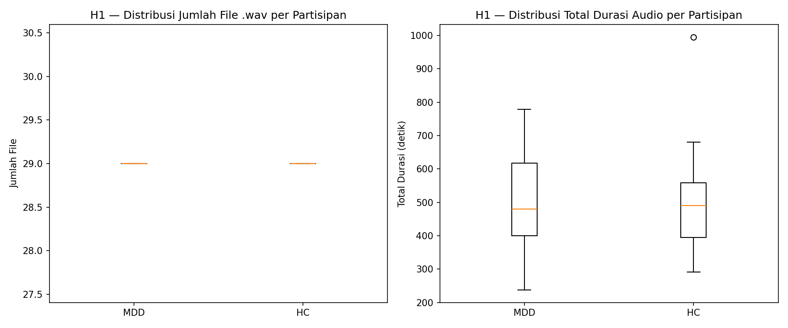
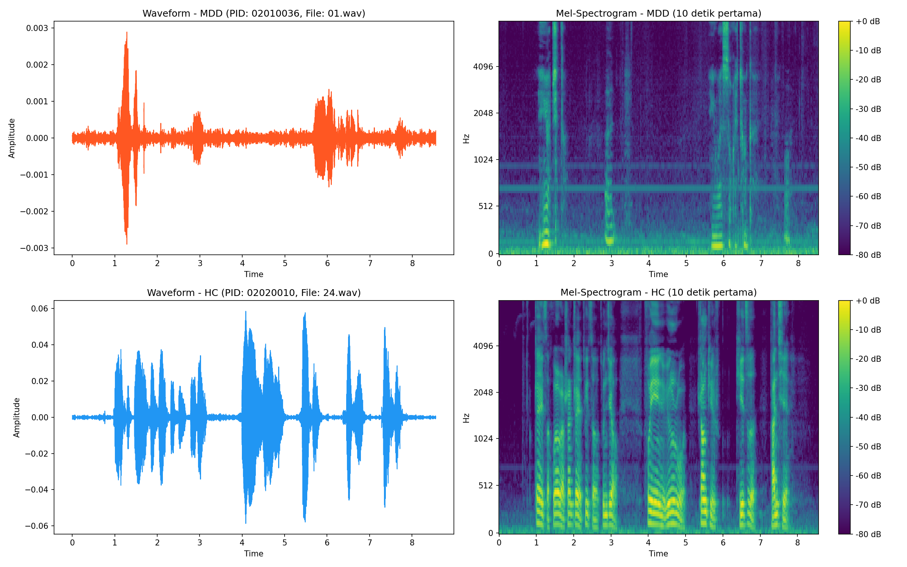

# Eksplorasi Data Audio MODMA

Dokumen ini berisi hasil Eksplorasi Data Analysis (EDA) khusus untuk dataset audio MODMA. Proses analisis dijalankan menggunakan skrip `H_modma_audio.py` di dalam direktori `explorasi`.

## 1. Distribusi Dataset & Durasi

Berbeda dengan dataset DAIC-WOZ di mana 1 partisipan umumnya memiliki 1 file audio wawancara panjang, pada MODMA setiap partisipan merekam banyak file pendek.

- **Total Partisipan**: 52 Partisipan (29 HC, 23 MDD)
- **Rata-rata Jumlah File/Partisipan**: Tepat 29 file `.wav` baik untuk HC maupun MDD.
- **Rata-rata Total Durasi/Partisipan**:
  - HC: ~496.3 detik (~8.2 menit)
  - MDD: ~499.1 detik (~8.3 menit)
- **Rata-rata Durasi Per File Rekaman**: ~17 detik (baik HC maupun MDD).

> [!TIP]
> Fakta bahwa jumlah file secara konsisten adalah 29 file per partisipan menandakan adanya *structured task* (tugas membaca/berbicara terstruktur) saat pengambilan data MODMA (berbeda dengan DAIC-WOZ yang bersifat percakapan bebas / wawancara). Total durasi antara kelompok MDD dan HC sangat seimbang.

### Visualisasi Distribusi Jumlah dan Durasi

## 2. Dekode Jenis Tugas (Task Mapping)

Berdasarkan literatur *"Application of Pre-trained Model-based Speech Analysis in Depression Detection"*, 29 file audio per partisipan pada MODMA dikategorikan ke dalam 4 jenis tugas:

| Nama File | Jenis Tugas | Detail |
| :--- | :--- | :--- |
| **01 - 18** | **Interview Speech** | Jawaban atas 18 pertanyaan (6 positif, 6 netral, 6 negatif). |
| **19** | **Paragraph Reading** | Membaca dongeng *"The North Wind and the Sun"*. |
| **20 - 25** | **Word Reading** | Membaca 6 set kata-kata (positif, netral, negatif). |
| **26 - 29** | **Picture Description** | Mendeskripsikan 4 gambar yang berbeda secara spontan. |

> [!IMPORTANT]
> Literatur menunjukkan bahwa **Picture Description (26-29)** memiliki akurasi deteksi tertinggi karena memicu ekspresi emosional yang lebih natural dibanding tugas membaca yang cenderung monoton.

## 2. Karakteristik Audio (Sampling Rate)

- **Total File Audio**: 1.503 file
- **Sampling Rate**: Semua file (100%) memiliki sampling rate **44.100 Hz** (44.1 kHz). 

> [!NOTE]
> Kualitas audio sangat konsisten. Saat kita akan menggabungkannya ke model pipeline, pastikan kita mendownsample ke standar yang sama dengan DAIC-WOZ jika kita akan memodelkan kedua dataset sekaligus (biasanya 16kHz sudah cukup untuk deteksi suara/speech), atau biarkan 44.1kHz jika kita hanya melatih model di atas MODMA saja.

## 3. Sampel Visualisasi Waveform & Spectrogram

Berikut adalah contoh pengambilan secara acak cuplikan audio selama 10 detik dari 1 penderita Major Depressive Disorder (MDD) dan 1 Healthy Control (HC).

## Kesimpulan Awal & Rekomendasi Literatur

1.  **Dataset Kualitas Tinggi:** Kondisi perekaman sangat terkontrol (<60dB background noise), menjadikannya dataset yang sangat handal untuk ekstraksi fitur akustik halus (seperti *jitter* dan *shimmer*).
2.  **Strategi Ekstraksi Fitur:** Literatur merekomendasikan **Opsi A** (Ekstraksi per tugas) atau modifikasi **Opsi B** (Menggabungkan per kategori tugas). Menggabungkan semua 29 file tanpa pembedaan dapat "mengencerkan" sinyal depresi yang kuat dari tugas spesifik.
3.  **Indikator Akustik Kunci:** Berdasarkan riset, penderita depresi pada dataset ini menunjukkan rentang pitch yang lebih sempit dan durasi jeda (*pause duration*) yang lebih panjang secara signifikan.

## 4. Temuan Utama Literatur (Insights)

*   **Benchmark Akurasi:** Model Machine Learning klasik (SVM/RF) pada MODMA umumnya mencapai akurasi **~74-76%**. Penggunaan model Deep Learning (Wav2Vec 2.0 XLSR) dapat mendongkrak akurasi hingga **89.5%**.
*   **VAD (Voice Activity Detection):** Disarankan untuk membuang bagian hening (*silence*) sebelum ekstraksi fitur agar statistik rata-rata (mean) tidak terdistorsi oleh bagian tanpa suara.
*   **Segmentasi:** Untuk memperbanyak data, gunakan *sliding window* dengan overlap (misal: 5 detik window, 2.5 detik overlap).

## 4. Metadata Labeling Tambahan

Berdasarkan analisis file `subjects_information_audio_lanzhou_2015.xlsx`, dataset MODMA tidak hanya menyediakan label diagnosis biner (MDD vs HC), tetapi juga label kuantitatif dari berbagai kuesioner psikologi:

1. **Depresi (Depression):**
   - **`type`**: Label diagnostik (MDD atau HC).
   - **`PHQ-9`**: Patient Health Questionnaire-9 (skor 0-25).
2. **Kecemasan (Anxiety):**
   - **`GAD-7`**: Generalized Anxiety Disorder-7 (skor 0-21).
3. **Stres & Trauma (Stress):**
   - **`LES`**: Life Events Scale (tingkat stres akibat peristiwa kehidupan).
   - **`CTQ-SF`**: Childhood Trauma Questionnaire (trauma masa lalu).
4. **Kualitas Tidur:**
   - **`PSQI`**: Pittsburgh Sleep Quality Index.

5. **Stabilitas Model:** 
   Eksperimen menunjukkan bahwa pembagian data (splitting) wajib dilakukan di tingkat **Participant ID** (Stratified Split) untuk menghindari *subject leakage* yang sering terjadi di dataset audio medis.
