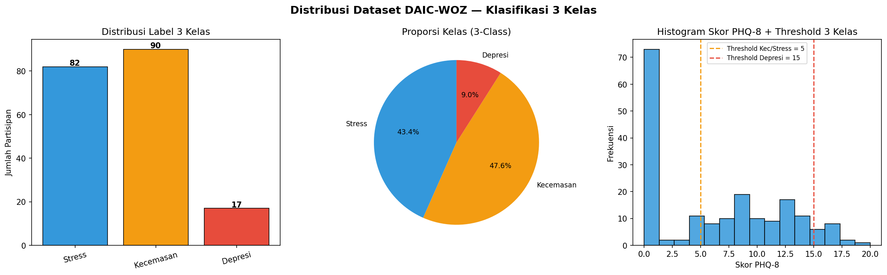
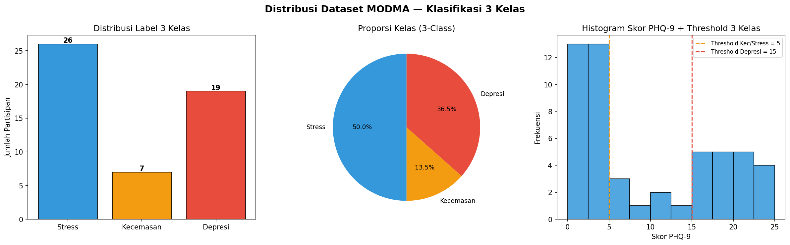

# Laporan Tugas Fase 1: Riset, Literatur, dan Setup (W1-W2)

**Assignment:** Fase 1 W1-W2 Riset, Literature dan Setup  
**Dosen/Asesor:** Muhammad Ridha  
**Poin:** 100 poin  

---

## 1. Aktivitas yang Telah Dilakukan
Berdasarkan pembagian tugas pada Fase 1, langkah-langkah yang telah saya selesaikan untuk memenuhi tugas ini adalah:
- **Request akses dataset DAIC-WOZ / MODMA:** Dataset terkait telah diunggah informasinya ke Canva board dan data *raw* sudah disiapkan pada server/lokal.
- **Studi literatur *audio depression detection*:** Referensi ekstensif telah saya rangkum baik melalui tautan Google Drive yang disertakan maupun di dalam file dokumentasi (`docs/literaturreview.md`).
- **Setup Python environment:** Repositori telah dilengkapi dengan environment yang valid (berdasarkan `requirements.txt`) menggunakan `librosa`, `sklearn`, `SHAP`, `pandas`, hingga framework lainnya.
- **Eksplorasi awal data audio (EDA):** Telah dilakukan melalui serangkaian script eksplorasi data (Pipeline Part 1) untuk melakukan scanning dataset, memastikan kelengkapan *audio*, fitur *covarep*, *transcript*, hingga mendistribusikan metadata.

---

## 2. Analisis Isi Repositori (`menthealth-ml`)
🔗 **Repository Link:** [https://github.com/athilaramdani/menthealth-ml](https://github.com/athilaramdani/menthealth-ml)

Saya telah membangun struktur pipeline machine learning lengkap (berada di folder `experiments/daic`) untuk mengeksekusi model dengan baik. Berikut adalah analisis seluruh isi repositori:

* **Direktori `experiments/daic` & `experiments/modma` (Pipeline Utuh)**
  Tahapan proyek dibagi dari Part 1 hingga Part 7 yang mengatur seluruh siklus *machine learning*, serta terdapat file `Part1_Dataset_Overview.py` (dan bentuk Jupyter `.ipynb`) di dalam subdirektori MODMA untuk analisis awal dataset MODMA:
  * **Part 1 (Dataset Overview):** Script untuk me-load dataset (DAIC-WOZ dan MODMA), mengecek file `_AUDIO.wav` dsb, melakukan pembacaan label *ground truth* (PHQ-8 untuk DAIC-WOZ, dan metadata Excel PHQ-9 untuk MODMA), lalu membagi dataset menjadi 3 kelas target (Stress, Kecemasan, Depresi).
  * **Part 2 (Preprocessing):** Menangani pra-pemrosesan sinyal seperti resample dan pembuangan hening (*Voice Activity Detection*).
  * **Part 3 (Feature Extraction):** Ekstraksi fitur akustik penting (MFCC, Pitch/F0, RMS Energy).
  * **Part 4 & Part 5 (Dataset Building & Split Data):** Pembentukan tabular dan strategi cross-validation yang ketat dengan cara pemisahan *training-test* per partisipan (bukan segmen) guna menghindari data *leakage*.
  * **Part 6 & Part 7 (Training Model & XAI):** Pelatihan model berbasis ML (SVM, RF, XGBoost) dan visualisasi Explainable AI (SHAP / LIME) untuk menginterpretasikan alasan model memberikan hasil prediksi klasifikasi.
* **Direktori `docs`**
  Berisi seluruh dokumentasi teknis seperti *dataset analysis*, rencana pipeline awal (`rencana_pipeline_daic.md`), detail pembagian tugas 8 minggu (`tugasdetail.md`), dan catatan studi literatur mendalam.
* **File Konfigurasi (`requirements.txt`, script `.bat` dll)**
  Mendukung konversi dan manajemen *dependencies* environment untuk memastikan eksperimen bisa direproduksi.

---

## 3. Dataset Overview
Berikut adalah data detail untuk dataset yang telah dikumpulkan berdasarkan riset di Canva Board:

### **DAIC-WOZ (Distress Analysis Interview Corpus)**
* **Dataset Name:** DAIC-WOZ (Distress Analysis Interview Corpus)
* **Source:** USC ICT (University of Southern California)
* **Type:** Multimodal Dataset (Audio, Video, Text Transcript)
* **Use Case:** Depression Detection / Mental Health Analysis
* **Link Dataset:** [https://dcapswoz.ict.usc.edu/wwwdaicwoz/](https://dcapswoz.ict.usc.edu/wwwdaicwoz/)
* **Total Size:** ± 85–90 GB (compressed)
* **Total Zip:** ± 189 zip
* **Size per ZIP:** ± 200-600 Mb

**Struktur Folder per Partisipan (DAIC-WOZ):**
Setiap partisipan memiliki folder berformat `{ID}_P` (contoh: `300_P`). Di dalamnya terdapat:
* `300_AUDIO.wav`: Rekaman wawancara audio mentah (durasi belasan menit).
* `300_TRANSCRIPT.csv`: Transkrip percakapan interaktif antara partisipan dengan agen virtual "Ellie".
* `300_COVAREP.csv`: Fitur akustik per-frame (Pitch, VUV, NAQ) yang telah diekstrak secara otomatis.
* `300_FORMANT.csv`: Fitur ekstraksi frekuensi vokal.
* `300_CLNF_*.txt`: Fitur visual gerakan wajah dari OpenFace (untuk modalitas visual/video).

### **MODMA (Multi-modal Open Dataset for Mental-disorder Analysis)**
* **Total Partisipan:** 52 Partisipan (29 Healthy Control/HC, 23 Major Depressive Disorder/MDD)
* **Rata-rata Jumlah File/Partisipan:** Tepat 29 file `.wav` baik untuk HC maupun MDD.
* **Rata-rata Total Durasi/Partisipan:**
  * HC: ~496.3 detik (~8.2 menit)
  * MDD: ~499.1 detik (~8.3 menit)
* **Rata-rata Durasi Per File Rekaman:** ~17 detik (baik HC maupun MDD).
* **Total File Audio:** 1.503 file.

**Struktur Folder per Partisipan (MODMA):**
Partisipan disimpan dalam folder bernomor ID unik (contoh: `02010001`). Pendekatannya bersifat *task-oriented*, di mana 1 folder partisipan berisi tepat **29 file `.wav`**, yang dipisah berdasarkan jenis tugas:
* `01.wav` – `18.wav`: Rekaman sesi wawancara/tanya jawab.
* `19.wav`: Rekaman sesi membaca paragraf panjang.
* `20.wav` – `25.wav`: Rekaman sesi membaca daftar kata secara individu.
* `26.wav` – `29.wav`: Rekaman sesi deskripsi gambar secara spontan (umumnya paling emosional).
*(Catatan: MODMA hanya menyediakan audio mentah dan Excel metadata klinis, tidak ada transcript otomatis maupun fitur akustik yang pre-extracted).*

---

## 4. Studi Literatur Audio Detection
Studi literatur eksternal untuk deteksi audio telah disediakan pada referensi berikut:
🔗 **[Link Studi Literatur Audio Detection](https://drive.google.com/file/d/1fi6F6izKbRMCJcjxB94V4VVNlePfffMO/view?usp=sharing)**

Sebagai tambahan, riset internal dalam repo (berdasarkan `docs/literaturreview.md`) mencatatkan bahwa fitur seperti MFCC, Pitch (F0), dan RMS Energy adalah pendekatan paling handal dalam membedakan suara normal, cemas, maupun depresi.

---

## 5. Eksplorasi dan Setup Repositori
Sebagaimana tergambar dalam script utama di direktori ini (`Part1_Dataset_Overview.py`), eksplorasi (*Exploratory Data Analysis*) telah dilakukan dengan tahapan sebagai berikut:
1. **Verifikasi File**: Melakukan *scanning* otomatis ke ± 189 subdirektori partisipan untuk memastikan *Audio* dan *Covarep* tersedia lengkap.
2. **Konversi Ground Truth (PHQ-8)**: Karena skor diagnosis tidak ada langsung di file CSV COVAREP, skor PHQ-8 diinjeksi via mapping manual sesuai publikasi asli dataset.
3. **Thresholding 3 Kelas**: Membangun klasifikasi baru untuk mengatasi depresi secara lebih spesifik, yaitu:
   * Skor 0-4: **Stress**
   * Skor 5-14: **Kecemasan**
   * Skor ≥ 15: **Depresi**
4. **Distribusi Metadata**: Hasilnya dikompilasi menjadi `daic_metadata.csv` dan ditranslasikan dalam visualisasi statistik sebaran kelas untuk memberikan dasar kokoh terhadap tahapan *feature engineering* di minggu selanjutnya.

Berikut adalah visualisasi hasil Exploratory Data Analysis (EDA) yang menunjukkan distribusi 3-kelas pada dataset DAIC-WOZ:

*Gambar: Distribusi label 3 kelas pada DAIC-WOZ (Stress, Kecemasan, Depresi), proporsi kelas, serta histogram penyebaran skor PHQ-8 dengan garis batas threshold.*

Berikut adalah visualisasi hasil Exploratory Data Analysis (EDA) yang menunjukkan distribusi 3-kelas pada dataset MODMA:

*Gambar: Distribusi label 3 kelas pada MODMA (Stress, Kecemasan, Depresi), proporsi kelas, serta histogram penyebaran skor PHQ-9 dengan garis batas threshold.*
